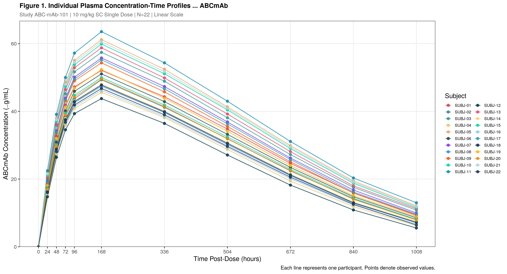
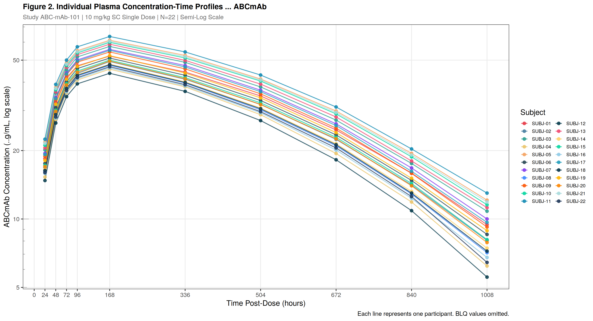
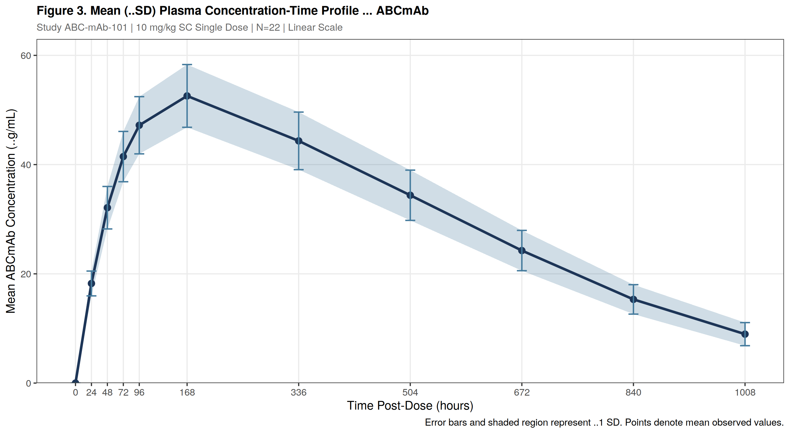
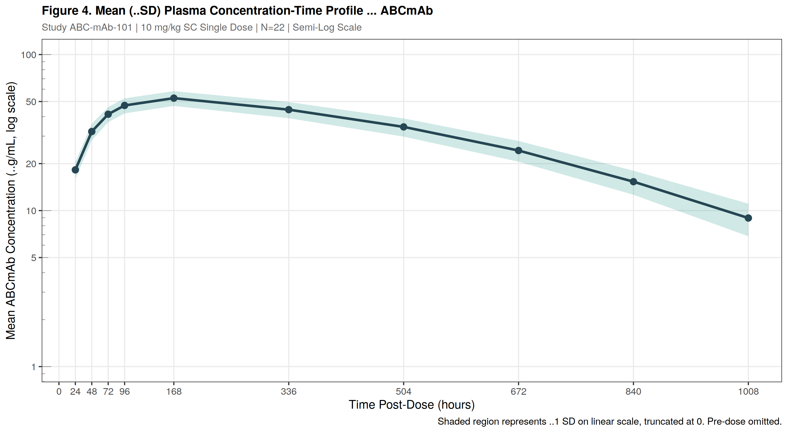
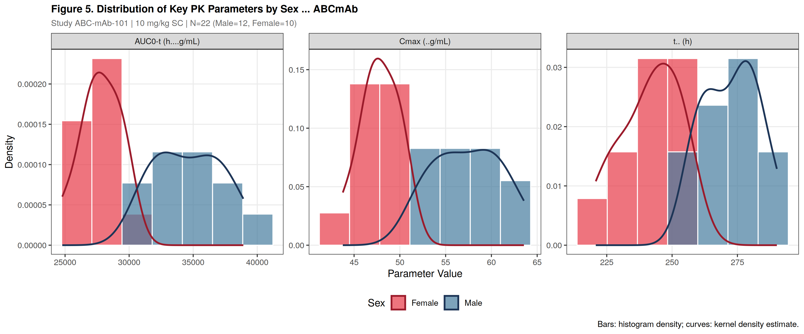
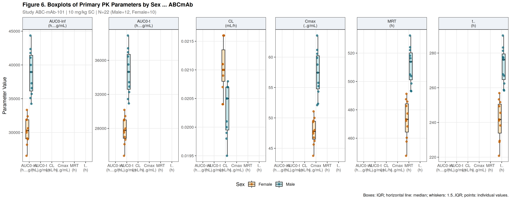

# Phase I Pharmacokinetic Analysis — ABCmAb (ABC-mAb-101)

**Non-Compartmental Analysis (NCA) | Monoclonal Antibody | N = 22 Healthy Volunteers**

> A fully reproducible R implementation of NCA from raw data entry through to CSR-ready tables, listings, and figures (TLFs). Developed as a sample deliverable demonstrating clinical PK statistical programming capability.

---

## Study Overview

| Item | Detail |
|---|---|
| Study ID | ABC-mAb-101 |
| Product | ABCmAb — monoclonal antibody |
| Route / Dose | Subcutaneous, 10 mg/kg single dose |
| Population | 22 healthy adult volunteers (12 male, 10 female) |
| Age range | 27–55 years |
| Weight range | 56–88 kg |
| Sampling schedule | 0, 24, 48, 72, 96, 168, 336, 504, 672, 840, 1008 h post-dose |
| Analyte | ABCmAb parent compound (µg/mL plasma) |
| NCA method | Linear-up / log-down trapezoidal rule |
| Software | R (base NCA implementation, PKNCA-equivalent methodology) |

---

## Repository Structure

```
mAb-NCA-Analysis/
│
├── mAb_NCA_Analysis.R          # Main analysis script (single file, fully self-contained)
│
├── output/
│   ├── TBL1_Demographics.txt               # Table 1: Demographic and baseline characteristics
│   ├── TBL2_Individual_PK_Parameters.txt   # Table 2: Individual NCA parameters (all 22 subjects)
│   ├── TBL3_Summary_PK_Parameters.txt      # Table 3: Descriptive statistics (mean, SD, CV%, etc.)
│   │
│   ├── LST1_Individual_Concentrations.txt  # Listing 1: Individual observed concentrations + BLQ flags
│   ├── LST2_Individual_PK_Listing.txt      # Listing 2: Full individual PK parameters per subject
│   ├── LST3_Sampling_Deviations.txt        # Listing 3: Sampling time deviation record
│   │
│   ├── FIG1_Individual_Linear.png          # Figure 1: Individual profiles — linear scale
│   ├── FIG2_Individual_SemiLog.png         # Figure 2: Individual profiles — semi-log scale
│   ├── FIG3_Mean_Linear.png                # Figure 3: Mean ± SD profile — linear scale
│   ├── FIG4_Mean_SemiLog.png               # Figure 4: Mean ± SD profile — semi-log scale
│   ├── FIG5_PK_Distributions.png           # Figure 5: Cmax / AUC / t½ distributions by sex
│   ├── FIG6_PK_Boxplots.png                # Figure 6: Key parameter boxplots by sex
│   │
│   └── CSR_Statistical_Section.txt         # CSR-ready statistical section (ICH E3 structure)
│
└── README.md
```

---

## How to Run

### Requirements

```r
# Packages required (install if not present)
install.packages(c(
  "ggplot2", "dplyr", "tidyr", "scales",
  "purrr", "stringr", "grid"
))
```

R version 4.0 or later is recommended. No proprietary software or licences are required.

### Execution

```r
# Clone the repository, then run the single script
source("mAb_NCA_Analysis.R")
```

The script runs from data entry through to all outputs in one pass. All output files are written to the `output/` folder automatically.

---

## NCA Parameters Computed

### Primary Parameters

| Parameter | Description | Units |
|---|---|---|
| Cmax | Maximum observed concentration | µg/mL |
| Cmax/D | Dose-normalised Cmax | µg/mL/mg |
| tmax | Time to Cmax | h |
| AUC0-t | AUC from time 0 to last quantifiable timepoint | h·µg/mL |
| AUC0-inf | AUC extrapolated to infinity | h·µg/mL |
| AUC0-t/D | Dose-normalised AUC0-t | h·µg/mL/mg |
| AUC0-inf/D | Dose-normalised AUC0-inf | h·µg/mL/mg |
| Clast | Last observed quantifiable concentration | µg/mL |
| tlast | Time of last quantifiable concentration | h |
| kel | Terminal elimination rate constant | 1/h |
| t½ | Terminal half-life | h |
| MRT | Mean residence time | h |
| Vz | Apparent volume of distribution | mL |
| CL | Apparent clearance | mL/h |

### Secondary / QC Parameters

| Parameter | Description |
|---|---|
| %AUC Extrapolated | Percentage of AUC0-inf beyond tlast |
| Adjusted R² | Goodness of fit for kel log-linear regression |
| kel interval | Time range used for kel estimation |

---

## Key Results Summary

| Parameter | Mean | SD | CV% | Median |
|---|---|---|---|---|
| Cmax (µg/mL) | 52.58 | 5.74 | 10.9% | 51.58 |
| AUC0-t (h·µg/mL) | 31,197 | 4,100 | 13.1% | 30,553 |
| AUC0-inf (h·µg/mL) | 34,576 | 5,135 | 14.9% | 33,795 |
| t½ (h) | 257.1 | 19.2 | 7.5% | 257.6 |
| MRT (h) | 492.0 | 23.4 | 4.8% | 492.2 |
| CL (mL/h) | 0.020 | — | 2.8% | 0.020 |
| %AUC Extrapolated | 9.55% | 1.56 | 16.3% | 9.57% |
| Adj. R² (kel) | 0.986 | — | 0.4% | 0.990 |

Between-subject variability in Cmax and AUC0-t was 10.9% and 13.1% respectively, consistent with the low variability expected under weight-based dosing of a monoclonal antibody. Terminal half-life of approximately 257 hours (~10.7 days) is consistent with FcRn-mediated IgG recycling. Mean AUC extrapolation of 9.55% confirms adequate sampling duration for reliable AUC0-inf estimation.

---

## Figures

### Figure 1 — Individual Concentration-Time Profiles (Linear Scale)


### Figure 2 — Individual Concentration-Time Profiles (Semi-Log Scale)


### Figure 3 — Mean ± SD Concentration-Time Profile (Linear Scale)


### Figure 4 — Mean ± SD Concentration-Time Profile (Semi-Log Scale)


### Figure 5 — Distribution of Key PK Parameters by Sex


### Figure 6 — Boxplots of Primary PK Parameters by Sex


---

## Methodology Notes

**BLQ Handling.** Pre-dose BLQ values are set to zero. Post-dose BLQ values are set to zero for AUC calculation (M1 rule), consistent with FDA and EMA guidance on BLQ treatment in NCA.

**AUC Method.** The linear-up/log-down trapezoidal rule is applied throughout. Ascending intervals use the linear trapezoid; declining intervals use the log trapezoid. This method minimises bias in AUC estimation for mono-exponential decline.

**kel Estimation.** The terminal rate constant is estimated by unweighted log-linear regression over the last four quantifiable timepoints per participant. A minimum adjusted R² of 0.90 is required; all 22 participants met this criterion (mean adj. R² = 0.986).

**MRT Calculation.** MRT is estimated as AUMC0-inf / AUC0-inf using the moment trapezoidal method with extrapolation beyond tlast.

**Sampling Deviations.** Actual sampling times are recorded and deviations greater than one hour from nominal are flagged in Listing 3. All flagged samples were retained in the analysis following protocol-specified criteria.

---

## Deliverables Checklist

- [x] Dataset review and structure verification
- [x] BLQ imputation with M1 rule documented
- [x] Individual NCA parameter calculations (all 22 subjects)
- [x] Summary statistics table (N, mean, SD, CV%, median, min, max)
- [x] Demographic and baseline characteristics table
- [x] Individual concentration-time profiles (linear and semi-log)
- [x] Mean ± SD concentration-time profiles (linear and semi-log)
- [x] Parameter distribution figures with sex stratification
- [x] Individual concentration listings with BLQ and deviation flags
- [x] Individual PK parameter listings per subject
- [x] Sampling time deviation record
- [x] CSR statistical section (ICH E3 structure)

---

## Author

**Kibet Philip**
Statistician and Data Analyst
Available via Upwork for clinical PK/PD statistical programming, NCA, and CSR support.

---

## Disclaimer

This repository contains simulated data generated for demonstration purposes only. No real participant data are included. All concentrations, demographics, and study identifiers are fictional and do not represent any actual clinical study or regulatory submission.
